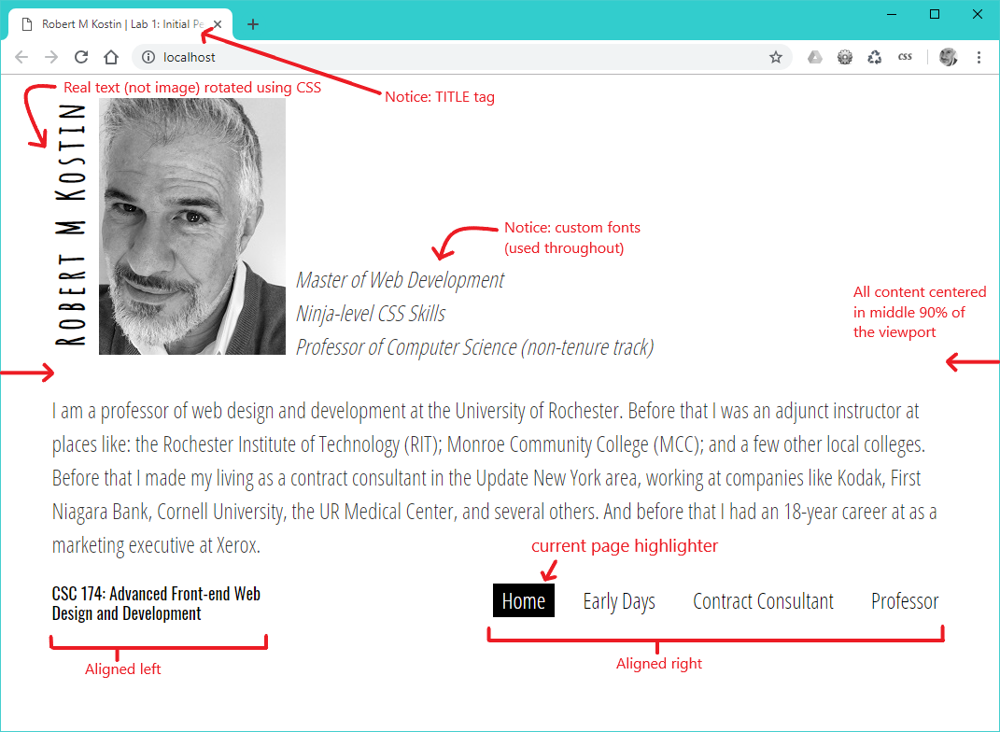
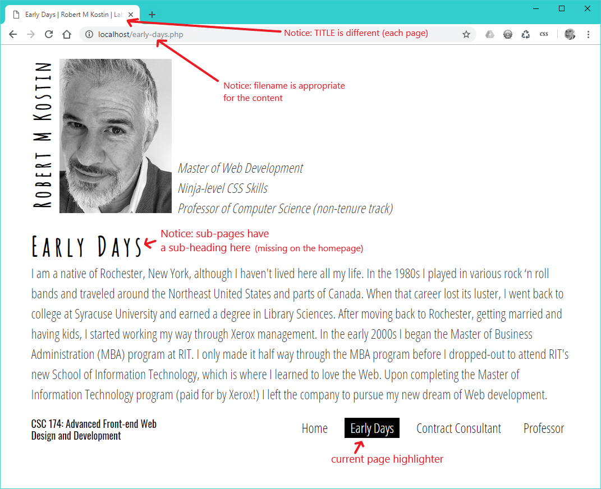

# <s>In-class Lab</s> Assignment 1: Initial Personal Website
*Due: Monday, January 28 (updated)*

The goal of this assignment is to simply apply a lot of the basic skills you learned in CSC 170. 

## Requirements

For this assignment, you need to replicate the following design, using your own content.

Subsequent pages...

Technical requirements include the following:

***Structure***

- [ ] There must be **four webpages**, all linked together using a **common navigation element**.
- [ ] All HTML must be **semantically correct**, **properly structured**, and **valid** according to the [W3C HTML Validator](https://validator.w3.org/)

***Style***

- [ ] The appearance of the website must **approximate as closely as possible, the examples above**.
- [ ] The CSS must exist in an **externally linked stylesheet**, and the CSS must be **valid** according to the to the [W3C CSS Validator](http://jigsaw.w3.org/css-validator/)

***Technical***

- [ ] The navigation element must **indicate which is the current page**

  - You can use any solution to highlight the current page, but if need be you can always use [the professor's JavaScript plugin from CSC 170 (ZIP)](menu-highlighter.zip)
- [ ] The website must use **PHP Includes** as appropriate for redundant content
- [ ] The **files and file system** must be clean and follow industry best practices
  - [ ] **No unused files**
  - [ ] Files of certain types (e.g. images, CSS, includes) must be properly sorted into **sub-directories**
  - [ ] **Folder names and filenames** must be logical and make sense for what they contain (and the first page of the website must be named: **index**)
  - [ ] **Image file(s)** must be properly optimized and appropriately sized for the web

## Installation

- [ ] The website must be installed on your **Digital Scholar** account

## Submit the Assignment

To get credit for your work, submit a link to your website in Blackboard, in the assignment: **Assignment 1: Initial Personal Website**

