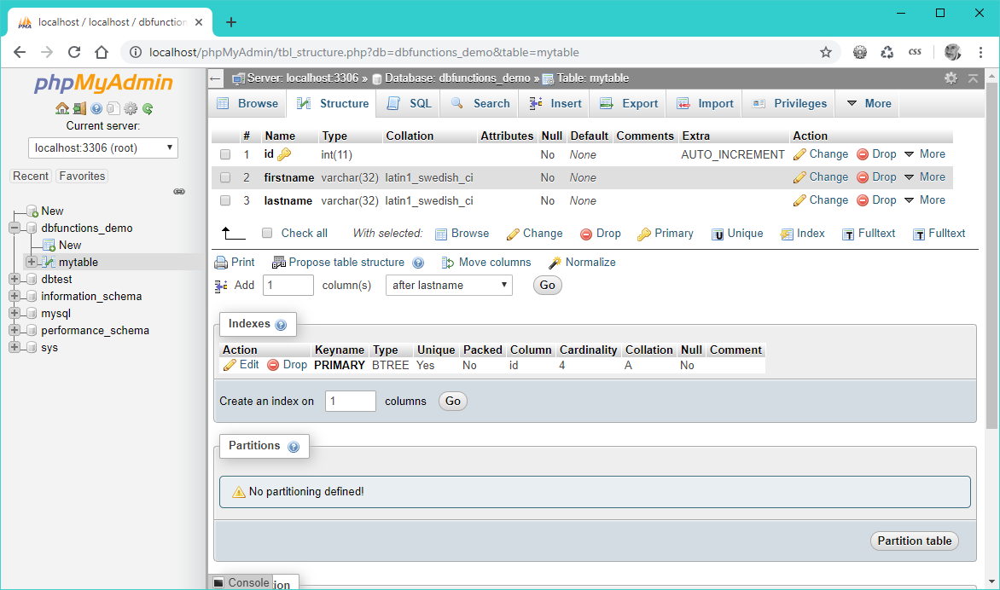

# In-class Lab 7: Remote Databases

*Due: Monday, April 1, 2019 (during class)*

This is an **individual in-class lab**.  You will *not* be working as a team on this one.

On Wednesday, March 27, we completed part of the the in-class exercise: **Four Database Functions**.  

1. We downloaded the ZIP'd files, [four-functions.zip](../18-four-functions/four-functions.zip), and put those files in our localhost web root (or a sub-directory named four-functions)
2. In our local phpMyAdmin, we created a database named: **dbfunctions_demo**, with a user by the same name, and all privileges assigned
3. In that database, **dbfunctions_demo**, we used the SQL script provided, **create-table.sql**, to create the table named, **mytable**

The database in your phpMyAdmin should look something like this:

4. In a web browser pointed to **localhost**, we went to the index of the four functions application and used it to:

  - create records

  - view records

  - edit records

  - delete records

  ...those are the four functions

The application should look something like this:

The next step in the process is to move your database from your localhost to a remote host (our class' Bluehost account).

## Step 1. Export the Database

1. In phpMyAdmin, click on **dbfunctions_demo** in the left-side bar to make sure you're in that database
2. Click the **Export** tab above the main area, and then on the Exporting tables... page, click the Go button to create the file: **dbfunctions_demo.sql** and save it somewhere.  
3. Open the file: **dbfunctions_demo.sql** in your code editor
4. Search for every instance of "**mytable**" and  replace it with a new table name based on your first initial and last name, example "**rkostin**"
   - Not counting the comments, there are four instances of mytable you need to find and replace
5. Save and close the file and put it aside. You'll need it soon.

## Step 2. Login to Bluehost

1. Go to www.bluehost.com
2. Login with domain: **csc174.org**<br>And password: **coffee1N/21**
   - NOTE: please try and get the login right.  If you screw it up multiple times in a row, we'll all get locked out!
3. Once logged-in, click **cpanel** in the submenu

Then put this web browser tab with your connection to Bluehost aside.  You'll need it later.

## Step 3. Test Your Connection to the Remote Database

1. Download the file: [testmysql-remote.zip](testmysql-remote.zip) and unzip the PHP file
2. Put the file **testmysql-remote.php** in your localhost web root
   - Open the file in your code editor and take a look at the login information; notice the IP number instead of "localhost"
   - Also notice the name of the database; it's awkwardly long, but that's what Bluehost decided it must be
3. With the **testmysql-remote.php** file in your localhost, open it in a web browser
   - Maybe you'll get the "Connection OK" message in the viewport because someone else in CSC 174 already registered your "Class C" with Bluehost; if so, skip the next step about *Setup Remote Access...*
   - If, after a long wait, you get the "Connect Error (2002)" message, do the following step to setup remote access...

## Step 3a. Setup Remote Access to the Remote Database

You can skip this step if you got the "Connection OK" message in the previous step.  Else do the following.

1. Go back to the web browser tab open to Bluehost
2. In the cpanel, scroll down to click the **Remote MySQL** chicklet (or you'll probably find a link to it along the left-side, under "frequently used features")
3. On the "Remote Mysql Database Access" page, click the [Add] link to add **Your Class C** (<u>not</u> *your IP*)
4. When your Class C is showing in the text box, click the green **Add** button
5. Go back to your web browser pointed at **testmysql-remote.php** and refresh it;  you should get the "Connection OK" message in the viewport
6. In the web browser tab pointed to Bluehost, click **cpanel** in the submenu to go back to the cpanel

## Step 4. Import the Database on the Remote Server

1. In the cpanel, scroll down to click the **phpMyAdmin** chicklet (or you'll probably find a link to it along the left-side, under "frequently used features")
2. In the left-side bar, click the name of our Lab 7 database, **urcscon3_lab07**
3. Click the **Import** tab in the top area
4. Click the **Choose File** button and select the edited **dbfunctions_demo.sql** file from Step 1.
5. Scroll down and click the **Go** button

Hopefully, you'll see a long list of green messages.  If so, proceed to the next step.

## Step 5: Change the Connection Information

Go back to the files for the Four Functions application in your localhost

1. Copy the file **connect-db.php** - name the copy something like connect-db_backup.php 
2. Open the file **connect-db.php** in your code editor
3. Copy the login information from the **testmysql-remote.php** file into the **connect-db.php** file (or just copy and paste the following)

```php
$server = '66.147.242.186';
$user = 'urcscon3_lab07';
$pass = 'coffee1N';
$db = 'urcscon3_lab07';
```

4. Save and close the **connect-db.php** file

## Step 6: Use the Remote Database with your Local Web Application

1. Open the following PHP files from the Four Functions web application in your code editor
   - **index.php**
   - **new.php**
   - **delete.php**
   - **edit.php**
2. Search for every instance of "**mytable**" in those PHP files and replace them with the new table name based on your first initial and last name, example "**rkostin**"
   - In **index.php** there is one instance
   - In **new.php** there is one instance
   - In **delete.php** there is one instance
   - In **edit.php** there are two instances
3. Save and close those files
4. Test the Four Functions web application in your localhost again
   - Make some additions, edits, deletions ...whatever
   - In the phpMyAdmin that's pointed to the Bluehost web server (*not* your localhost) "browse" your table on the remote server; you should see your additions, edits, and deletions there

NOTE: getting credit for this lab is automatic.  When the professor sees your table in the **urcscon3_lab07** database, he'll give you credit for this assignment in Blackboard.